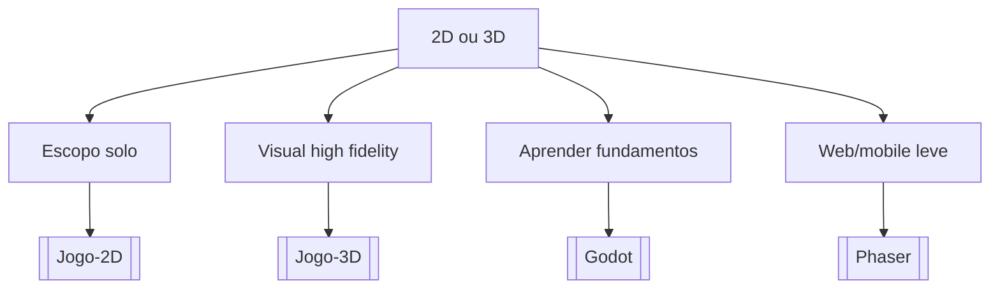

# 2D ou 3D

## Pergunta inicial
2D ou 3D?

## Versão em texto
- **Escopo solo** → [[Jogo-2D]]
- **Visual high fidelity** → [[Jogo-3D]]
- **Aprender fundamentos** → [[Godot]]
- **Web/mobile leve** → [[Phaser]]

## Diagrama

## Como usar com IA
Peça ao agente para escolher uma folha, justificar a escolha, listar premissas e apontar quais notas do vault devem ser estudadas antes de implementar.

## Conexões
- [[Home]] — voltar ao mapa geral.
- [[MOC-Fundamentos]] — conceitos transversais.
- [[Validacao-de-codigo-gerado-por-IA]] — validar qualquer caminho escolhido.
- [[Contrato-de-tarefa-para-agentes]] — transformar a decisão em tarefa.
