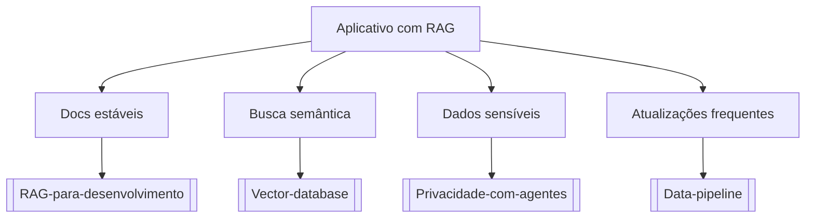

# Aplicativo com RAG

## Pergunta inicial
Aplicativo com RAG?

## Versão em texto
- **Docs estáveis** → [[RAG-para-desenvolvimento]]
- **Busca semântica** → [[Vector-database]]
- **Dados sensíveis** → [[Privacidade-com-agentes]]
- **Atualizações frequentes** → [[Data-pipeline]]

## Diagrama

## Como usar com IA
Peça ao agente para escolher uma folha, justificar a escolha, listar premissas e apontar quais notas do vault devem ser estudadas antes de implementar.

## Conexões
- [[Home]] — voltar ao mapa geral.
- [[MOC-Fundamentos]] — conceitos transversais.
- [[Validacao-de-codigo-gerado-por-IA]] — validar qualquer caminho escolhido.
- [[Contrato-de-tarefa-para-agentes]] — transformar a decisão em tarefa.
