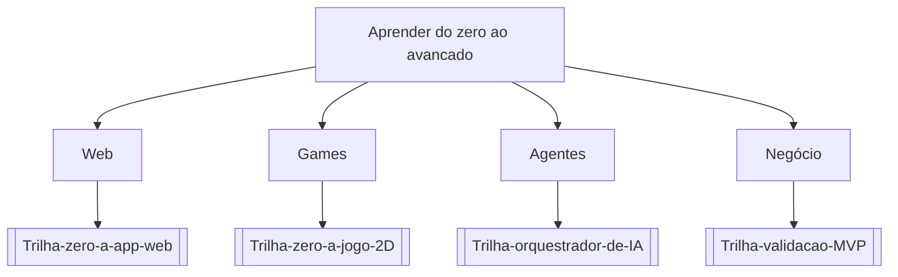

# Aprender do zero ao avancado

## Pergunta inicial
Aprender do zero ao avancado?

## Versão em texto
- **Web** → [[Trilha-zero-a-app-web]]
- **Games** → [[Trilha-zero-a-jogo-2D]]
- **Agentes** → [[Trilha-orquestrador-de-IA]]
- **Negócio** → [[Trilha-validacao-MVP]]

## Diagrama

## Como usar com IA
Peça ao agente para escolher uma folha, justificar a escolha, listar premissas e apontar quais notas do vault devem ser estudadas antes de implementar.

## Conexões
- [[Home]] — voltar ao mapa geral.
- [[MOC-Fundamentos]] — conceitos transversais.
- [[Validacao-de-codigo-gerado-por-IA]] — validar qualquer caminho escolhido.
- [[Contrato-de-tarefa-para-agentes]] — transformar a decisão em tarefa.
