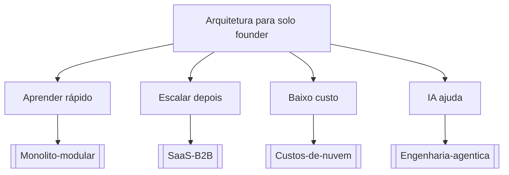

# Arquitetura para solo founder

## Pergunta inicial
Arquitetura para solo founder?

## Versão em texto
- **Aprender rápido** → [[Monolito-modular]]
- **Escalar depois** → [[SaaS-B2B]]
- **Baixo custo** → [[Custos-de-nuvem]]
- **IA ajuda** → [[Engenharia-agentica]]

## Diagrama

## Como usar com IA
Peça ao agente para escolher uma folha, justificar a escolha, listar premissas e apontar quais notas do vault devem ser estudadas antes de implementar.

## Conexões
- [[Home]] — voltar ao mapa geral.
- [[MOC-Fundamentos]] — conceitos transversais.
- [[Validacao-de-codigo-gerado-por-IA]] — validar qualquer caminho escolhido.
- [[Contrato-de-tarefa-para-agentes]] — transformar a decisão em tarefa.
