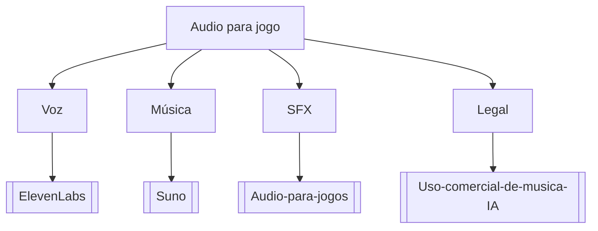

# Audio para jogo

## Pergunta inicial
Audio para jogo?

## Versão em texto
- **Voz** → [[ElevenLabs]]
- **Música** → [[Suno]]
- **SFX** → [[Audio-para-jogos]]
- **Legal** → [[Uso-comercial-de-musica-IA]]

## Diagrama

## Como usar com IA
Peça ao agente para escolher uma folha, justificar a escolha, listar premissas e apontar quais notas do vault devem ser estudadas antes de implementar.

## Conexões
- [[Home]] — voltar ao mapa geral.
- [[MOC-Fundamentos]] — conceitos transversais.
- [[Validacao-de-codigo-gerado-por-IA]] — validar qualquer caminho escolhido.
- [[Contrato-de-tarefa-para-agentes]] — transformar a decisão em tarefa.
