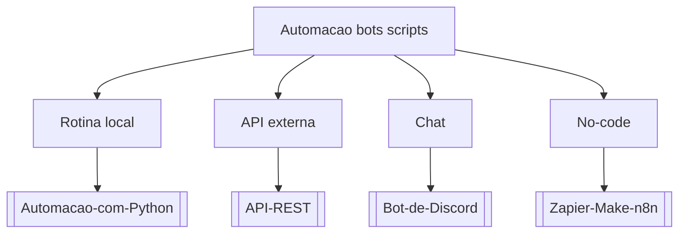

# Automacao bots scripts

## Pergunta inicial
Automacao bots scripts?

## Versão em texto
- **Rotina local** → [[Automacao-com-Python]]
- **API externa** → [[API-REST]]
- **Chat** → [[Bot-de-Discord]]
- **No-code** → [[Zapier-Make-n8n]]

## Diagrama

## Como usar com IA
Peça ao agente para escolher uma folha, justificar a escolha, listar premissas e apontar quais notas do vault devem ser estudadas antes de implementar.

## Conexões
- [[Home]] — voltar ao mapa geral.
- [[MOC-Fundamentos]] — conceitos transversais.
- [[Validacao-de-codigo-gerado-por-IA]] — validar qualquer caminho escolhido.
- [[Contrato-de-tarefa-para-agentes]] — transformar a decisão em tarefa.
