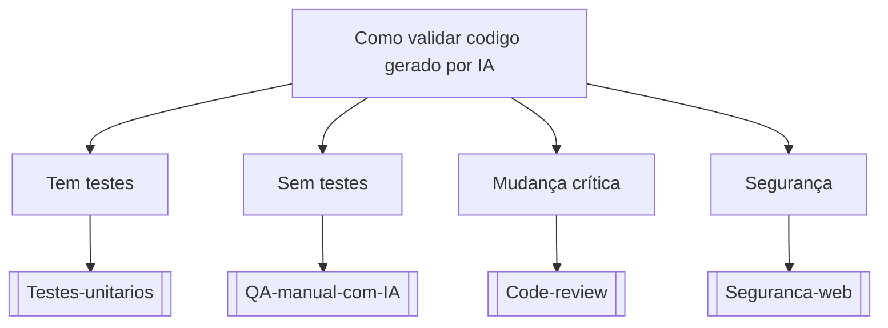

# Como validar codigo gerado por IA

## Pergunta inicial
Como validar codigo gerado por IA?

## Versão em texto
- **Tem testes** → [[Testes-unitarios]]
- **Sem testes** → [[QA-manual-com-IA]]
- **Mudança crítica** → [[Code-review]]
- **Segurança** → [[Seguranca-web]]

## Diagrama

## Como usar com IA
Peça ao agente para escolher uma folha, justificar a escolha, listar premissas e apontar quais notas do vault devem ser estudadas antes de implementar.

## Conexões
- [[Home]] — voltar ao mapa geral.
- [[MOC-Fundamentos]] — conceitos transversais.
- [[Validacao-de-codigo-gerado-por-IA]] — validar qualquer caminho escolhido.
- [[Contrato-de-tarefa-para-agentes]] — transformar a decisão em tarefa.
