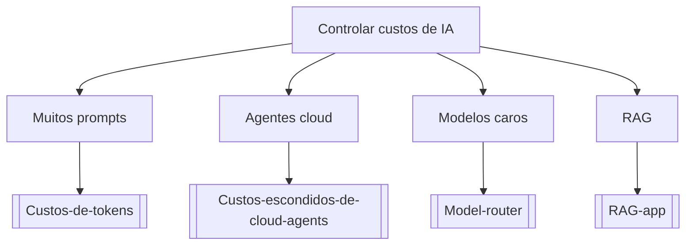

# Controlar custos de IA

## Pergunta inicial
Controlar custos de IA?

## Versão em texto
- **Muitos prompts** → [[Custos-de-tokens]]
- **Agentes cloud** → [[Custos-escondidos-de-cloud-agents]]
- **Modelos caros** → [[Model-router]]
- **RAG** → [[RAG-app]]

## Diagrama

## Como usar com IA
Peça ao agente para escolher uma folha, justificar a escolha, listar premissas e apontar quais notas do vault devem ser estudadas antes de implementar.

## Conexões
- [[Home]] — voltar ao mapa geral.
- [[MOC-Fundamentos]] — conceitos transversais.
- [[Validacao-de-codigo-gerado-por-IA]] — validar qualquer caminho escolhido.
- [[Contrato-de-tarefa-para-agentes]] — transformar a decisão em tarefa.
