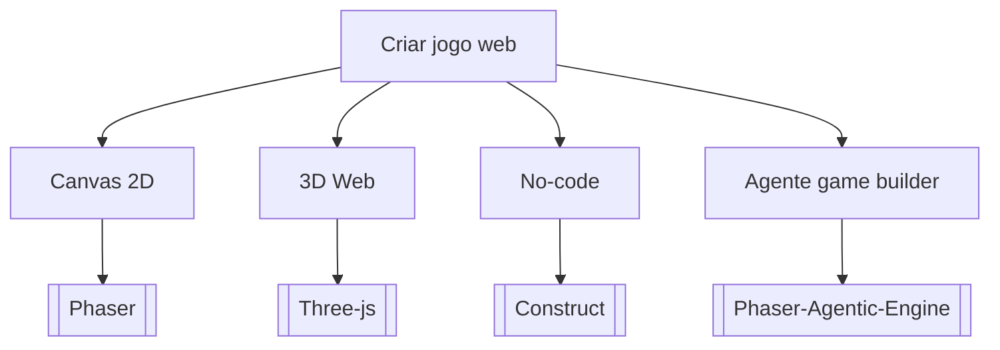

# Criar jogo web

## Pergunta inicial
Criar jogo web?

## Versão em texto
- **Canvas 2D** → [[Phaser]]
- **3D Web** → [[Three-js]]
- **No-code** → [[Construct]]
- **Agente game builder** → [[Phaser-Agentic-Engine]]

## Diagrama

## Como usar com IA
Peça ao agente para escolher uma folha, justificar a escolha, listar premissas e apontar quais notas do vault devem ser estudadas antes de implementar.

## Conexões
- [[Home]] — voltar ao mapa geral.
- [[MOC-Fundamentos]] — conceitos transversais.
- [[Validacao-de-codigo-gerado-por-IA]] — validar qualquer caminho escolhido.
- [[Contrato-de-tarefa-para-agentes]] — transformar a decisão em tarefa.
