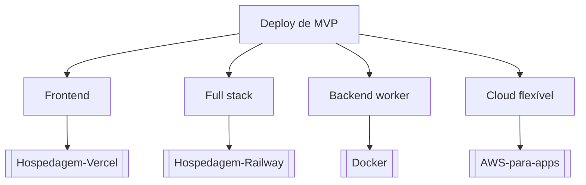

# Deploy de MVP

## Pergunta inicial
Deploy de MVP?

## Versão em texto
- **Frontend** → [[Hospedagem-Vercel]]
- **Full stack** → [[Hospedagem-Railway]]
- **Backend worker** → [[Docker]]
- **Cloud flexível** → [[AWS-para-apps]]

## Diagrama

## Como usar com IA
Peça ao agente para escolher uma folha, justificar a escolha, listar premissas e apontar quais notas do vault devem ser estudadas antes de implementar.

## Conexões
- [[Home]] — voltar ao mapa geral.
- [[MOC-Fundamentos]] — conceitos transversais.
- [[Validacao-de-codigo-gerado-por-IA]] — validar qualquer caminho escolhido.
- [[Contrato-de-tarefa-para-agentes]] — transformar a decisão em tarefa.
