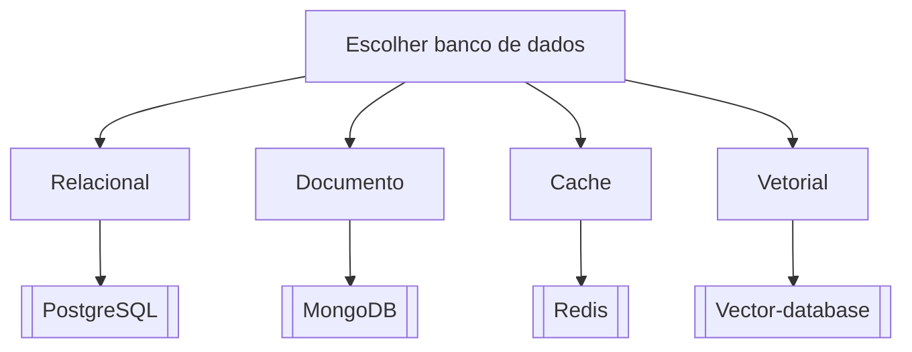

# Escolher banco de dados

## Pergunta inicial
Escolher banco de dados?

## Versão em texto
- **Relacional** → [[PostgreSQL]]
- **Documento** → [[MongoDB]]
- **Cache** → [[Redis]]
- **Vetorial** → [[Vector-database]]

## Diagrama

## Como usar com IA
Peça ao agente para escolher uma folha, justificar a escolha, listar premissas e apontar quais notas do vault devem ser estudadas antes de implementar.

## Conexões
- [[Home]] — voltar ao mapa geral.
- [[MOC-Fundamentos]] — conceitos transversais.
- [[Validacao-de-codigo-gerado-por-IA]] — validar qualquer caminho escolhido.
- [[Contrato-de-tarefa-para-agentes]] — transformar a decisão em tarefa.
