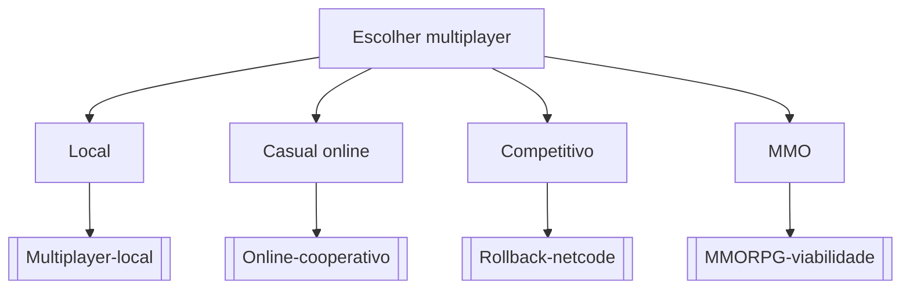

# Escolher multiplayer

## Pergunta inicial
Escolher multiplayer?

## Versão em texto
- **Local** → [[Multiplayer-local]]
- **Casual online** → [[Online-cooperativo]]
- **Competitivo** → [[Rollback-netcode]]
- **MMO** → [[MMORPG-viabilidade]]

## Diagrama

## Como usar com IA
Peça ao agente para escolher uma folha, justificar a escolha, listar premissas e apontar quais notas do vault devem ser estudadas antes de implementar.

## Conexões
- [[Home]] — voltar ao mapa geral.
- [[MOC-Fundamentos]] — conceitos transversais.
- [[Validacao-de-codigo-gerado-por-IA]] — validar qualquer caminho escolhido.
- [[Contrato-de-tarefa-para-agentes]] — transformar a decisão em tarefa.
