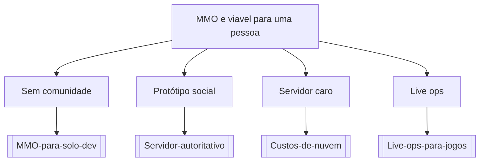

# MMO e viavel para uma pessoa

## Pergunta inicial
MMO e viavel para uma pessoa?

## Versão em texto
- **Sem comunidade** → [[MMO-para-solo-dev]]
- **Protótipo social** → [[Servidor-autoritativo]]
- **Servidor caro** → [[Custos-de-nuvem]]
- **Live ops** → [[Live-ops-para-jogos]]

## Diagrama

## Como usar com IA
Peça ao agente para escolher uma folha, justificar a escolha, listar premissas e apontar quais notas do vault devem ser estudadas antes de implementar.

## Conexões
- [[Home]] — voltar ao mapa geral.
- [[MOC-Fundamentos]] — conceitos transversais.
- [[Validacao-de-codigo-gerado-por-IA]] — validar qualquer caminho escolhido.
- [[Contrato-de-tarefa-para-agentes]] — transformar a decisão em tarefa.
