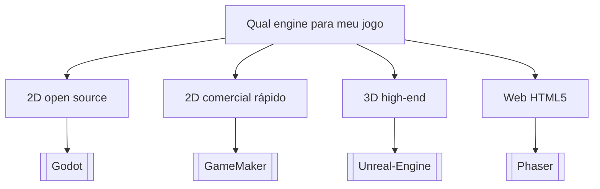

# Qual engine para meu jogo

## Pergunta inicial
Qual engine para meu jogo?

## Versão em texto
- **2D open source** → [[Godot]]
- **2D comercial rápido** → [[GameMaker]]
- **3D high-end** → [[Unreal-Engine]]
- **Web HTML5** → [[Phaser]]

## Diagrama

## Como usar com IA
Peça ao agente para escolher uma folha, justificar a escolha, listar premissas e apontar quais notas do vault devem ser estudadas antes de implementar.

## Conexões
- [[Home]] — voltar ao mapa geral.
- [[MOC-Fundamentos]] — conceitos transversais.
- [[Validacao-de-codigo-gerado-por-IA]] — validar qualquer caminho escolhido.
- [[Contrato-de-tarefa-para-agentes]] — transformar a decisão em tarefa.
