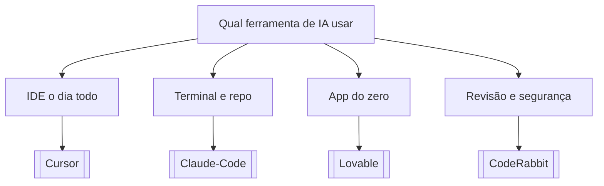

# Qual ferramenta de IA usar

## Pergunta inicial
Qual ferramenta de IA usar?

## Versão em texto
- **IDE o dia todo** → [[Cursor]]
- **Terminal e repo** → [[Claude-Code]]
- **App do zero** → [[Lovable]]
- **Revisão e segurança** → [[CodeRabbit]]

## Diagrama

## Como usar com IA
Peça ao agente para escolher uma folha, justificar a escolha, listar premissas e apontar quais notas do vault devem ser estudadas antes de implementar.

## Conexões
- [[Home]] — voltar ao mapa geral.
- [[MOC-Fundamentos]] — conceitos transversais.
- [[Validacao-de-codigo-gerado-por-IA]] — validar qualquer caminho escolhido.
- [[Contrato-de-tarefa-para-agentes]] — transformar a decisão em tarefa.
