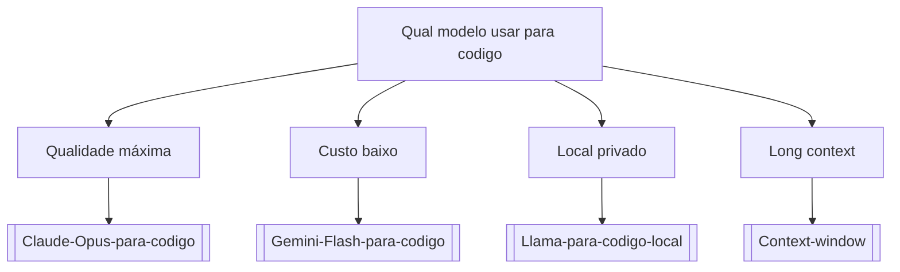

# Qual modelo usar para codigo

## Pergunta inicial
Qual modelo usar para codigo?

## Versão em texto
- **Qualidade máxima** → [[Claude-Opus-para-codigo]]
- **Custo baixo** → [[Gemini-Flash-para-codigo]]
- **Local privado** → [[Llama-para-codigo-local]]
- **Long context** → [[Context-window]]

## Diagrama

## Como usar com IA
Peça ao agente para escolher uma folha, justificar a escolha, listar premissas e apontar quais notas do vault devem ser estudadas antes de implementar.

## Conexões
- [[Home]] — voltar ao mapa geral.
- [[MOC-Fundamentos]] — conceitos transversais.
- [[Validacao-de-codigo-gerado-por-IA]] — validar qualquer caminho escolhido.
- [[Contrato-de-tarefa-para-agentes]] — transformar a decisão em tarefa.
