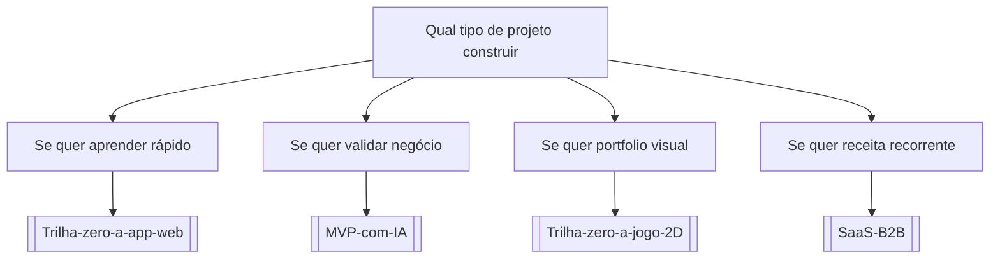

# Qual tipo de projeto construir

## Pergunta inicial
Qual tipo de projeto construir?

## Versão em texto
- **Se quer aprender rápido** → [[Trilha-zero-a-app-web]]
- **Se quer validar negócio** → [[MVP-com-IA]]
- **Se quer portfolio visual** → [[Trilha-zero-a-jogo-2D]]
- **Se quer receita recorrente** → [[SaaS-B2B]]

## Diagrama

## Como usar com IA
Peça ao agente para escolher uma folha, justificar a escolha, listar premissas e apontar quais notas do vault devem ser estudadas antes de implementar.

## Conexões
- [[Home]] — voltar ao mapa geral.
- [[MOC-Fundamentos]] — conceitos transversais.
- [[Validacao-de-codigo-gerado-por-IA]] — validar qualquer caminho escolhido.
- [[Contrato-de-tarefa-para-agentes]] — transformar a decisão em tarefa.
