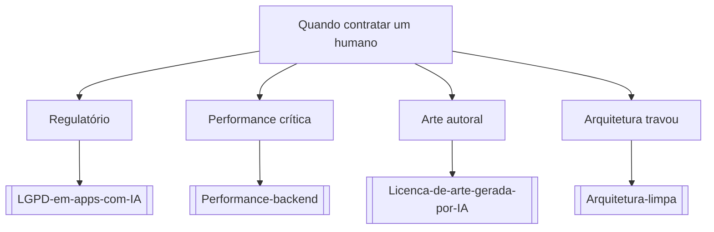

# Quando contratar um humano

## Pergunta inicial
Quando contratar um humano?

## Versão em texto
- **Regulatório** → [[LGPD-em-apps-com-IA]]
- **Performance crítica** → [[Performance-backend]]
- **Arte autoral** → [[Licenca-de-arte-gerada-por-IA]]
- **Arquitetura travou** → [[Arquitetura-limpa]]

## Diagrama

## Como usar com IA
Peça ao agente para escolher uma folha, justificar a escolha, listar premissas e apontar quais notas do vault devem ser estudadas antes de implementar.

## Conexões
- [[Home]] — voltar ao mapa geral.
- [[MOC-Fundamentos]] — conceitos transversais.
- [[Validacao-de-codigo-gerado-por-IA]] — validar qualquer caminho escolhido.
- [[Contrato-de-tarefa-para-agentes]] — transformar a decisão em tarefa.
