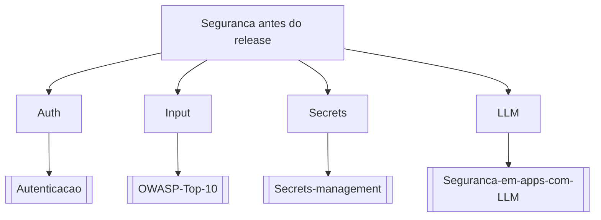

# Seguranca antes do release

## Pergunta inicial
Seguranca antes do release?

## Versão em texto
- **Auth** → [[Autenticacao]]
- **Input** → [[OWASP-Top-10]]
- **Secrets** → [[Secrets-management]]
- **LLM** → [[Seguranca-em-apps-com-LLM]]

## Diagrama

## Como usar com IA
Peça ao agente para escolher uma folha, justificar a escolha, listar premissas e apontar quais notas do vault devem ser estudadas antes de implementar.

## Conexões
- [[Home]] — voltar ao mapa geral.
- [[MOC-Fundamentos]] — conceitos transversais.
- [[Validacao-de-codigo-gerado-por-IA]] — validar qualquer caminho escolhido.
- [[Contrato-de-tarefa-para-agentes]] — transformar a decisão em tarefa.
