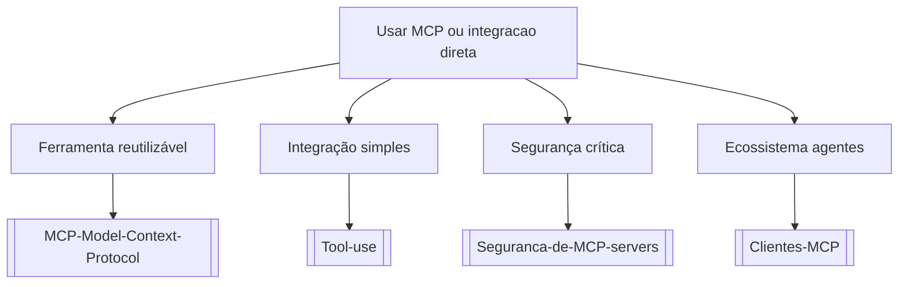

# Usar MCP ou integracao direta

## Pergunta inicial
Usar MCP ou integracao direta?

## Versão em texto
- **Ferramenta reutilizável** → [[MCP-Model-Context-Protocol]]
- **Integração simples** → [[Tool-use]]
- **Segurança crítica** → [[Seguranca-de-MCP-servers]]
- **Ecossistema agentes** → [[Clientes-MCP]]

## Diagrama

## Como usar com IA
Peça ao agente para escolher uma folha, justificar a escolha, listar premissas e apontar quais notas do vault devem ser estudadas antes de implementar.

## Conexões
- [[Home]] — voltar ao mapa geral.
- [[MOC-Fundamentos]] — conceitos transversais.
- [[Validacao-de-codigo-gerado-por-IA]] — validar qualquer caminho escolhido.
- [[Contrato-de-tarefa-para-agentes]] — transformar a decisão em tarefa.
