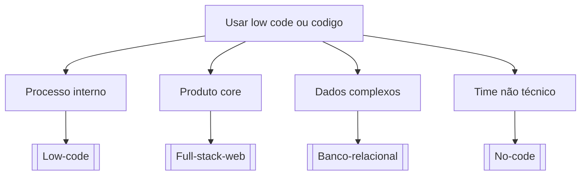

# Usar low code ou codigo

## Pergunta inicial
Usar low code ou codigo?

## Versão em texto
- **Processo interno** → [[Low-code]]
- **Produto core** → [[Full-stack-web]]
- **Dados complexos** → [[Banco-relacional]]
- **Time não técnico** → [[No-code]]

## Diagrama

## Como usar com IA
Peça ao agente para escolher uma folha, justificar a escolha, listar premissas e apontar quais notas do vault devem ser estudadas antes de implementar.

## Conexões
- [[Home]] — voltar ao mapa geral.
- [[MOC-Fundamentos]] — conceitos transversais.
- [[Validacao-de-codigo-gerado-por-IA]] — validar qualquer caminho escolhido.
- [[Contrato-de-tarefa-para-agentes]] — transformar a decisão em tarefa.
