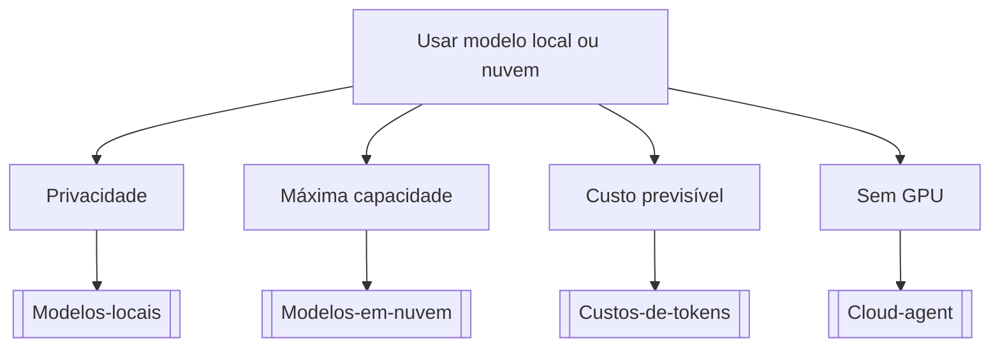

# Usar modelo local ou nuvem

## Pergunta inicial
Usar modelo local ou nuvem?

## Versão em texto
- **Privacidade** → [[Modelos-locais]]
- **Máxima capacidade** → [[Modelos-em-nuvem]]
- **Custo previsível** → [[Custos-de-tokens]]
- **Sem GPU** → [[Cloud-agent]]

## Diagrama

## Como usar com IA
Peça ao agente para escolher uma folha, justificar a escolha, listar premissas e apontar quais notas do vault devem ser estudadas antes de implementar.

## Conexões
- [[Home]] — voltar ao mapa geral.
- [[MOC-Fundamentos]] — conceitos transversais.
- [[Validacao-de-codigo-gerado-por-IA]] — validar qualquer caminho escolhido.
- [[Contrato-de-tarefa-para-agentes]] — transformar a decisão em tarefa.
