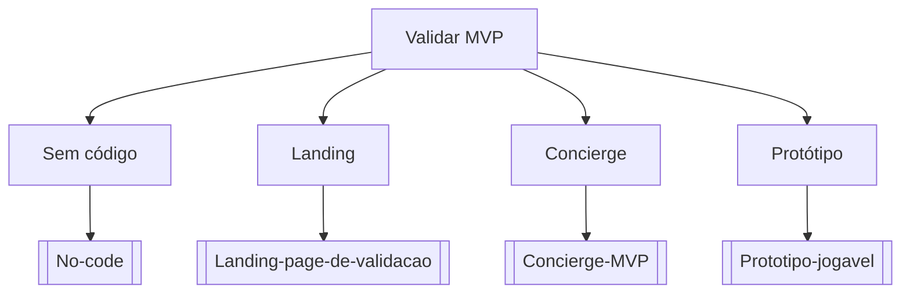

# Validar MVP

## Pergunta inicial
Validar MVP?

## Versão em texto
- **Sem código** → [[No-code]]
- **Landing** → [[Landing-page-de-validacao]]
- **Concierge** → [[Concierge-MVP]]
- **Protótipo** → [[Prototipo-jogavel]]

## Diagrama

## Como usar com IA
Peça ao agente para escolher uma folha, justificar a escolha, listar premissas e apontar quais notas do vault devem ser estudadas antes de implementar.

## Conexões
- [[Home]] — voltar ao mapa geral.
- [[MOC-Fundamentos]] — conceitos transversais.
- [[Validacao-de-codigo-gerado-por-IA]] — validar qualquer caminho escolhido.
- [[Contrato-de-tarefa-para-agentes]] — transformar a decisão em tarefa.
