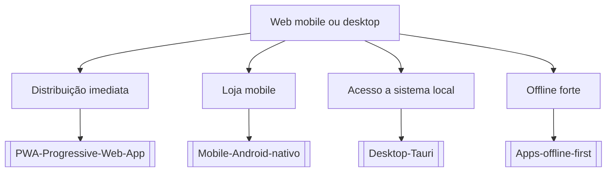

# Web mobile ou desktop

## Pergunta inicial
Web mobile ou desktop?

## Versão em texto
- **Distribuição imediata** → [[PWA-Progressive-Web-App]]
- **Loja mobile** → [[Mobile-Android-nativo]]
- **Acesso a sistema local** → [[Desktop-Tauri]]
- **Offline forte** → [[Apps-offline-first]]

## Diagrama

## Como usar com IA
Peça ao agente para escolher uma folha, justificar a escolha, listar premissas e apontar quais notas do vault devem ser estudadas antes de implementar.

## Conexões
- [[Home]] — voltar ao mapa geral.
- [[MOC-Fundamentos]] — conceitos transversais.
- [[Validacao-de-codigo-gerado-por-IA]] — validar qualquer caminho escolhido.
- [[Contrato-de-tarefa-para-agentes]] — transformar a decisão em tarefa.
